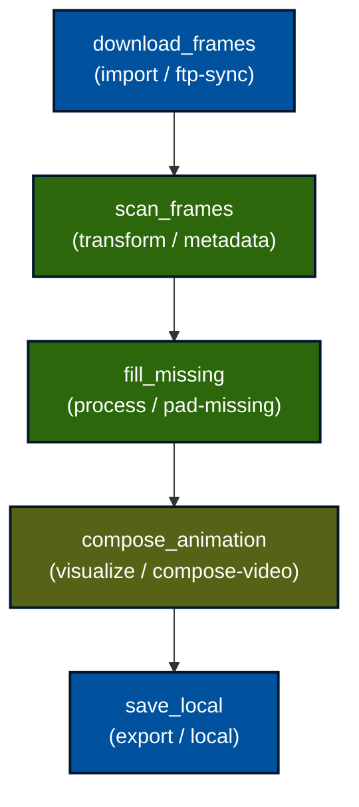
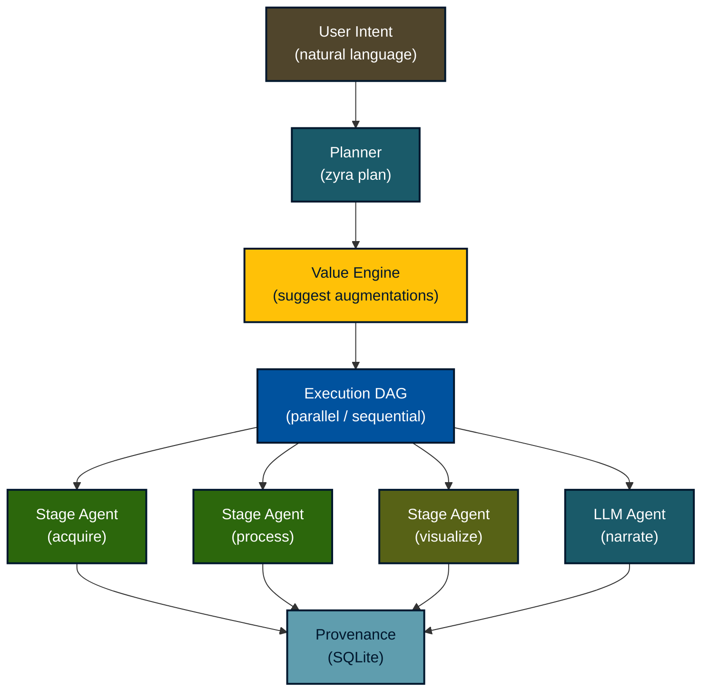
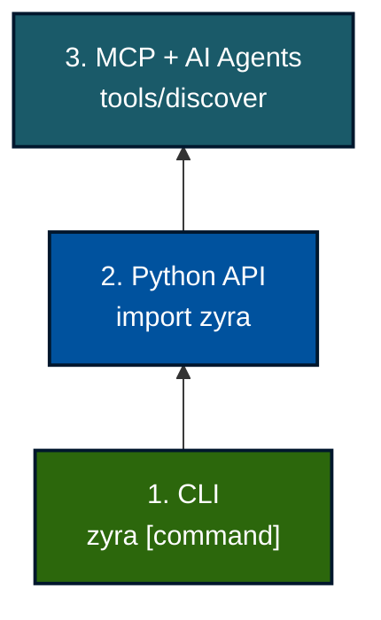

<div align="center">
  
  <h1>Zyra: Modular, Reproducible Data Workflows for Science</h1>
  <p><em>An Open-Source Python Framework by NOAA Global Systems Laboratory</em></p>
  <p>
    <strong>Eric Hackathorn</strong> &middot; NOAA GSL &middot;
    <a href="https://orcid.org/0000-0002-9693-2093">ORCID</a>
  </p>
  <p>
    <a href="https://pypi.org/project/zyra/"></a>
    <a href="https://noaa-gsl.github.io/zyra/"></a>
    <a href="https://doi.org/10.5281/zenodo.16923323"></a>
    <a href="https://github.com/NOAA-GSL/zyra"></a>
  </p>
</div>

---

## The Challenge

Environmental and scientific workflows span heterogeneous data sources (HTTP, FTP, S3, APIs) and formats (GRIB2, NetCDF, GeoTIFF). They require repeatable transformation chains and produce diverse outputs -- static maps, animations, interactive pages, and datasets. Existing approaches often rely on ad-hoc scripts that break when data changes and lack reproducibility across teams and environments.

**Zyra** provides a light-weight, CLI-first framework that standardizes common steps while remaining extensible for domain-specific logic.

---

## The Pipeline: 8 Composable Stages

```mermaid
graph LR
    A["1. Import\n(acquire)"] --> B["2. Process\n(transform)"]
    B --> C["3. Simulate"]
    C --> D["4. Decide\n(optimize)"]
    D --> E["5. Visualize\n(render)"]
    E --> F["6. Narrate"]
    F --> G["7. Verify"]
    G --> H["8. Export\n(disseminate)"]

    style A fill:#00529E,stroke:#00172D,color:#FEFEFE,stroke-width:2px
    style B fill:#2C670C,stroke:#00172D,color:#FEFEFE,stroke-width:2px
    style C fill:#8B8985,stroke:#A3A29D,color:#FEFEFE,stroke-width:1px,stroke-dasharray:5 5
    style D fill:#8B8985,stroke:#A3A29D,color:#FEFEFE,stroke-width:1px,stroke-dasharray:5 5
    style E fill:#576216,stroke:#00172D,color:#FEFEFE,stroke-width:2px
    style F fill:#1A5A69,stroke:#00172D,color:#FEFEFE,stroke-width:2px
    style G fill:#5F9DAE,stroke:#00172D,color:#00172D,stroke-width:2px
    style H fill:#00529E,stroke:#00172D,color:#FEFEFE,stroke-width:2px
```



| Stage | Purpose | CLI |
|-------|---------|-----|
| **Import** | Fetch from HTTP/S, S3, FTP, REST API | `zyra acquire` |
| **Process** | Decode, subset, convert (GRIB2, NetCDF, GeoTIFF) | `zyra process` |
| **Simulate** | Generate synthetic/test data | *planned* |
| **Decide** | Parameter optimization and selection | *planned* |
| **Visualize** | Static maps, plots, animations, interactive | `zyra visualize` |
| **Narrate** | AI-driven captions, summaries, reports | `zyra narrate` |
| **Verify** | Quality checks and metadata validation | `zyra verify` |
| **Export** | Push to S3, FTP, Vimeo, local, HTTP POST | `zyra export` |

Stages are **composable** -- use only what you need. Stages support **streaming** via stdin/stdout for Unix-style chaining:

```bash
zyra acquire http $URL -o - | zyra process convert-format - netcdf --stdout | zyra visualize heatmap --input - --var TMP -o plot.png
```

---

## Use Case: HRRR Weather Model Processing

Acquire the latest High-Resolution Rapid Refresh forecast, convert to NetCDF, and visualize temperature:

```bash
zyra acquire http https://noaa-hrrr-bdp-pds.s3.amazonaws.com/hrrr.20240101/conus/hrrr.t00z.wrfsfcf00.grib2 -o hrrr.grib2
zyra process convert-format hrrr.grib2 netcdf -o hrrr.nc
zyra visualize heatmap --input hrrr.nc --var TMP --colorbar --output hrrr_temp.png
```

<div align="center">
  
  <br/><em>Heatmap rendered by <code>zyra visualize heatmap</code></em>
</div>

---

## Use Case: Drought Animation Pipeline

A real-world production workflow syncs weekly drought risk frames from NOAA FTP, fills gaps, and composes a video -- all defined as a declarative YAML swarm manifest:



```bash
zyra swarm samples/swarm/drought_animation.yaml --parallel --memory provenance.sqlite
```

Each agent logs provenance (start time, duration, command, exit code) to a SQLite store for full reproducibility.

---

## Use Case: AI/LLM Narration Swarm

Zyra orchestrates multi-agent workflows where LLM-powered agents generate, critique, and refine narrative outputs:



The narration swarm chains **context**, **summary**, **critic**, and **editor** agents, each backed by configurable LLM providers:

| Provider | Usage |
|----------|-------|
| OpenAI | `--provider openai --model gpt-4` |
| Ollama | `--provider ollama --model gemma` |
| Gemini | `--provider gemini` |
| Mock | `--provider mock` (offline testing) |

Outputs are validated against Pydantic schemas with optional guardrails (RAIL files) for structured, reproducible results.

---

## Use Case: Reproducible Pipeline Configs

Define multi-stage pipelines as YAML -- no scripting required:

```yaml
name: FTP to Local Video
stages:
  - stage: acquire
    command: ftp
    args:
      path: ftp://ftp.nnvl.noaa.gov/SOS/DroughtRisk_Weekly
      sync_dir: ./frames
      since_period: "P1Y"
  - stage: visualize
    command: compose-video
    args:
      frames: ./frames
      output: video.mp4
      fps: 4
  - stage: export
    command: local
    args:
      input: video.mp4
      path: /output/video.mp4
```

```bash
zyra run pipeline.yaml                          # execute
zyra run pipeline.yaml --dry-run                 # preview commands
zyra run pipeline.yaml --set visualize.fps=8     # override parameters
```

---

## Building Off the Foundation

Zyra provides three layers of access — from terminal commands to autonomous AI agents — all sharing the same 8-stage pipeline architecture:



| Layer | Description |
|-------|-------------|
| **CLI** | Scriptable, streaming commands via `stdin/stdout` for Unix-style pipeline composition |
| **Python API** | Programmatic access via `import zyra` for custom modules and automated workflows |
| **MCP + AI Agents** | Every pipeline stage exposed as an MCP tool for LLM agent discovery and execution |

Whether invoked from bash, Python, REST (`zyra serve`), or an AI agent, every execution follows the same architecture with full provenance tracking.

---

## Visualization Gallery

<table>
  <tr>
    <td align="center">
      <br/>
      <code>zyra visualize heatmap</code>
    </td>
    <td align="center">
      <br/>
      <code>zyra visualize contour</code>
    </td>
  </tr>
  <tr>
    <td align="center">
      <br/>
      <code>zyra visualize vector</code>
    </td>
    <td align="center">
      <br/>
      <code>zyra visualize timeseries</code>
    </td>
  </tr>
</table>

---

## Key Features

- **Scientific formats**: GRIB2, NetCDF, GeoTIFF with xarray, cfgrib, rasterio
- **Connectors**: HTTP/S, S3, FTP, REST API, Vimeo
- **Visualization**: heatmaps, contours, vectors, particles, animations, interactive maps (Folium, Plotly)
- **AI integration**: multi-agent narration swarm, planning engine, value engine, guardrails
- **Provenance**: SQLite-based event logging for full reproducibility
- **Service mode**: FastAPI REST API + MCP tools for LLM integration
- **Modular extras**: `pip install "zyra[visualization]"`, `"zyra[processing]"`, `"zyra[llm]"`, or `"zyra[all]"`
- **Python 3.10+** &middot; **Apache 2.0** &middot; **CLI-first** &middot; **Streaming-friendly**

---

## Get Started

```bash
pip install zyra          # core
pip install "zyra[all]"   # everything
zyra --help               # explore commands
```

| Resource | Link |
|----------|------|
| GitHub | [github.com/NOAA-GSL/zyra](https://github.com/NOAA-GSL/zyra) |
| PyPI | [pypi.org/project/zyra](https://pypi.org/project/zyra/) |
| Documentation | [noaa-gsl.github.io/zyra](https://noaa-gsl.github.io/zyra/) |
| Wiki | [github.com/NOAA-GSL/zyra/wiki](https://github.com/NOAA-GSL/zyra/wiki) |
| DOI | [10.5281/zenodo.16923323](https://doi.org/10.5281/zenodo.16923323) |
